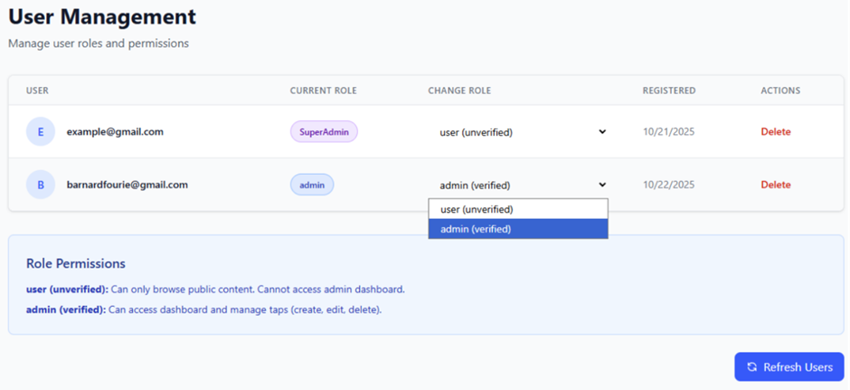
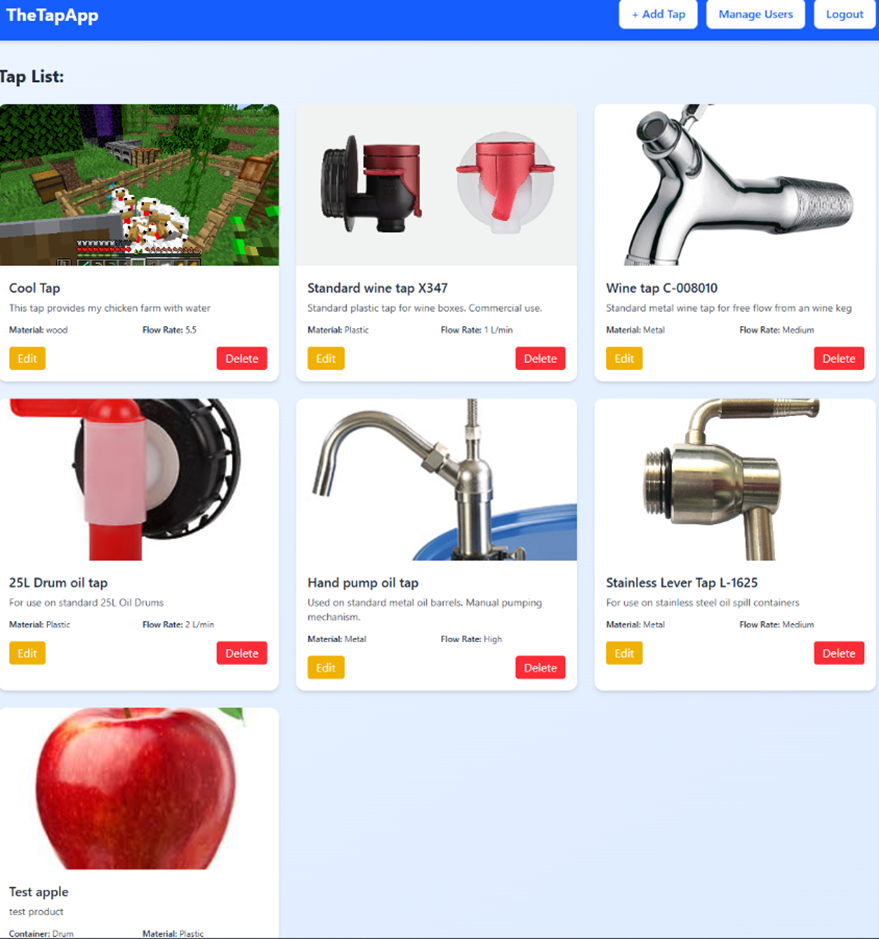
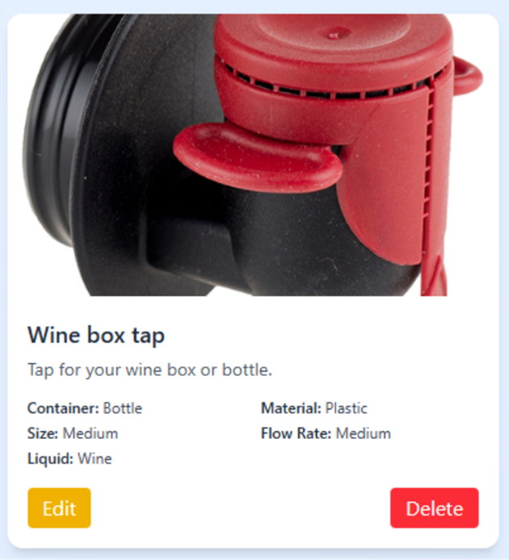
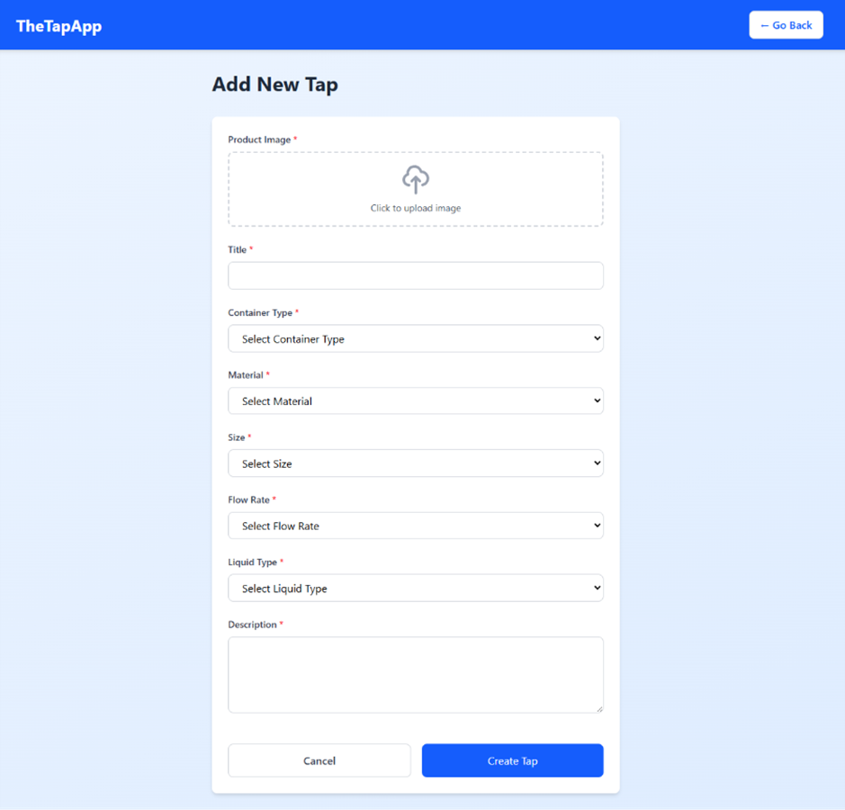
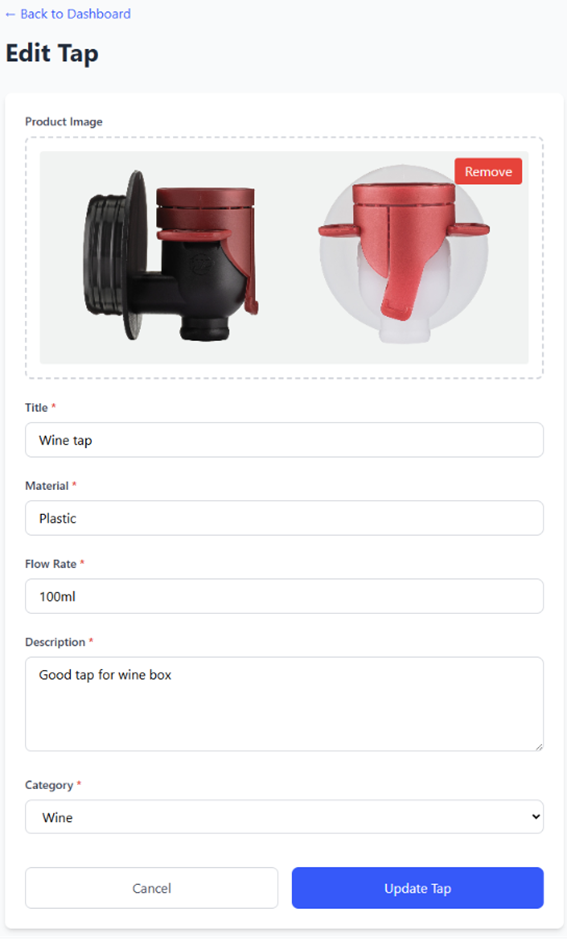

# Tap Manufacturer Query Application – Backend (Admin Routes)

## Overview
This backend service was part of a **Capstone group project** for a plastic tap manufacturing company.  
The goal was to replace a manual email system with an automated query management system consisting of:
- Android app (customer interface)
- React admin portal (management interface)
- **Node.js + Express + Redis backend (API layer)** ← *my contribution*

---

## My Role
I served as the **Admin Routes Developer & Integration Coordinator**.  
I implemented:
- Secure **admin authentication** (register/login with JWT + bcrypt)  
- **CRUD API endpoints** for tap product management  
- **Role-based access control** (Admin vs SuperAdmin)  
- **Rate limiting** and input validation for security  
- **Firebase integration** for product image storage  
- **System statistics endpoint** for reporting  

I also coordinated with 5 teammates, defining function signatures and integration points for Redis, JWT middleware, Firebase, and rate limiting.  
Some frontend files (React routing, API integration) were a **two‑person effort** where I contributed alongside a teammate.

---

## Tech Stack
- **Node.js + Express.js** – backend framework  
- **Redis** – NoSQL database for users and taps  
- **JWT** – authentication and route protection  
- **Firebase** – image storage  
- **bcryptjs** – password hashing  
- **helmet, express-rate-limit** – security middleware  
- **React + TypeScript** – admin portal frontend (team effort)

---

## Endpoints I Implemented

### Authentication
- `POST /api/admin/register` – Register new admin (default role: user)  
- `POST /api/admin/login` – Login, returns JWT token  

### User Management (SuperAdmin only)
- `GET /api/admin/users` – View all users  
- `PUT /api/admin/update-role` – Update user role  
- `DELETE /api/admin/delete-user/:email` – Delete user  

### Tap Management (Admin + SuperAdmin)
- `GET /api/admin/taps` – View all taps  
- `GET /api/admin/taps/:id` – View single tap  
- `POST /api/admin/taps` – Create new tap (with image upload)  
- `PUT /api/admin/taps/:id` – Update tap (with optional image replacement)  
- `DELETE /api/admin/taps/:id` – Delete tap and associated image  

### System
- `GET /api/admin/stats` – Retrieve system statistics (taps by category, total users)  
- `PUT /api/admin/change-password` – Change password for logged-in user  

---

## Frontend Screenshots

Below are selected screenshots from **TheTapApp** admin portal, which I co‑developed with a teammate. They demonstrate how the backend routes I built integrate with the React frontend.

### 1. User Management Dashboard

- Manage user roles and permissions (SuperAdmin vs Admin vs User).
- Change roles via dropdown, view registration dates, and delete users.
- Role permissions are clearly explained for transparency.

### 2. Tap List Dashboard

- Displays all taps with images, descriptions, materials, and flow rates.
- Admins can **edit** or **delete** taps directly from the dashboard.
- Navigation bar includes quick access to Add Tap, Manage Users, and Logout.

### 3. Tap Detail View

- Shows product details for a single tap (e.g., wine box tap).
- Includes image, container type, material, flow rate, and description.
- Edit/Delete buttons allow quick management.

### 4. Add Tap Form

- Clean form interface for creating new taps.
- Fields include title, container type, material, size, flow rate, liquid type, description, and image upload.
- Validations ensure required fields are completed before submission.

### 5. Edit Tap Interface

- Allows admins to update tap details and replace product images.
- Includes validation and secure update flow.
- Cancel/Update buttons for safe editing.

---

These screenshots highlight the **integration between backend APIs and frontend UI**, showing how authentication, CRUD operations, and role‑based access control work in practice.

---

## Security Features
- JWT authentication on all admin routes  
- Role-based access control (Admin vs SuperAdmin)  
- Rate limiting on critical endpoints  
- Password hashing with bcrypt  
- Input validation and error handling  

---

## Example Usage
```bash
# Register new admin
curl -X POST http://localhost:5000/api/admin/register \
  -H "Content-Type: application/json" \
  -d '{"email":"test@example.com","password":"securePass123"}'

# Login
curl -X POST http://localhost:5000/api/admin/login \
  -H "Content-Type: application/json" \
  -d '{"email":"test@example.com","password":"securePass123"}'
```
---

## Notes on Development

- Much of the code was generated with AI assistance, but I guided the design, specified requirements, and tested iteratively.
- I supervised integration with teammates, ensuring consistent response formats and error handling.
- I documented flows, testing strategies, and integration points for Redis, Firebase, and middleware.
- Frontend routing and API integration were partly my work, in collaboration with another teammate.

---

## Key Achievements

- Implemented 8 RESTful API endpoints
- Integrated 4 middleware components (Auth, Role, Rate Limit, Upload)
- Coordinated with 5 teammates as integration hub
- Established standardized response formats and error handling
- Documented technical specifications and testing strategy

---

## Setup

```bash
# Install dependencies
npm install

# Run development server
npm run dev

# Environment variables required:
ACCESS_TOKEN_SECRET=your_jwt_secret
REDIS_URL=redis://localhost:6379
FIREBASE_STORAGE_BUCKET=your_bucket
SUPER_ADMIN_EMAIL=your_email
SUPER_ADMIN_PASSWORD=your_password
```

## Status
Backend implementation complete.
Frontend integration (React + Android app) was handled with pair teams, with some files co‑developed.
This repo highlights my backend contributions and partial frontend work.
